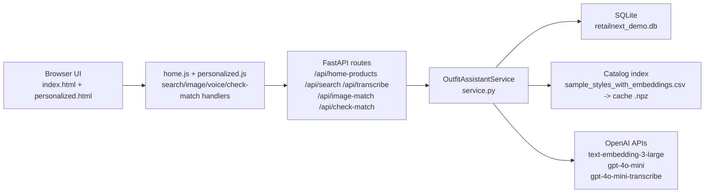

# RetailNext Outfit Assistant Demo (Web + API + DB)

RetailNext demo application for executive walkthroughs.

This version delivers a full stack:
- Frontend: COS/H&M-style storefront UI (desktop + mobile)
- Backend: FastAPI
- Persistence: SQLite (`data/retailnext_demo.db`)
- Retrieval: RAG-style similarity search on `sample_styles_with_embeddings.csv`
- Multimodal AI: text/image/voice search + recommendation + match scoring using OpenAI models

## Documentation

- [Documentation Index](./docs/README.md)
- [Architecture](./docs/ARCHITECTURE.md)
- [Check Your Match Scoring](./docs/CHECK_YOUR_MATCH.md)
- [Troubleshooting Guide](./docs/TROUBLESHOOTING.md)

## High-Level Diagram



## How to Demo with Bob Shopping Experience

1. **Home Feed + Gender Tabs**
- Landing page loads random catalog products from `/api/home-products`.
- Top nav gender filters call `/api/home-products?gender=Women|Men`.

2. **Natural-language-query-search**
- Bob types a request in the top search bar.
- App embeds the query and retrieves 10 closest catalog items.
- App routes to **Your Personalized Item** page.

3. **Voice Search**
- Bob clicks the mic icon, speaks, then the app posts audio to `/api/transcribe`.
- Returned transcript is inserted into the search bar and can be confirmed with **Find Items**.

4. **Image-upload-match**
- Bob clicks camera icon, uploads a JPG/PNG.
- App uses GPT-4o vision extraction, generates structured search queries, and retrieves 10 items.
- App routes to **Your Personalized Item** page.

5. **Check Your Match**
- Each recommendation has a **Check Your Match** button.
- App computes deterministic per-signal heuristic judgement details.
- If OpenAI is available, optional LLM judgement is added with timeout/fallback protection.
- Verdict/rationale/confidence are saved to DB and shown inline + in modal.

If Bob opens **Your Personalized Item** before searching/uploading, the page shows guidance text to start a flow first.

## Scoring At A Glance

- **Similarity** (shown on each recommendation card) is cosine similarity between query embedding and catalog item embedding.
- **Check Your Match confidence** is separate and comes from heuristic signal scoring (plus optional LLM judgement/fallback).

## Dataset Mapping

Primary 1:1 relationship is preserved:
- `sample_styles.csv` / `sample_styles_with_embeddings.csv` row `id`
- `sample_images/<id>.jpg`

The app uses `sample_styles_with_embeddings.csv` for retrieval and links images by `id`.

## Project Structure

```text
retailnext_outfit_assistant/
  app/
    api_server.py                # FastAPI app + routes
    web/
      index.html                 # Home storefront
      personalized.html          # Recommendations page
      styles.css
      home.js
      personalized.js
  data/
    sample_clothes/              # Downloaded cookbook data
    retailnext_demo.db           # SQLite persistence
  scripts/
    download_sample_clothes.py   # Pulls sample data from openai-cookbook
  src/retailnext_outfit_assistant/
    catalog.py                   # CSV + embedding index loader
    retrieval.py                 # cosine top-k
    openai_utils.py              # OpenAI calls
    db.py                        # SQLite schema + queries
    service.py                   # Orchestration (search/image/match)
```

## Quickstart

### 1) Install

```bash
cd retailnext_outfit_assistant
python3 -m venv .venv
./.venv/bin/pip install --upgrade pip
./.venv/bin/pip install -r requirements.txt
./.venv/bin/pip install -e .
```

### 2) Set environment variables

```bash
cp .env.template .env
# Edit .env and set OPENAI_API_KEY
```

### 3) Download sample data

```bash
./.venv/bin/python scripts/download_sample_clothes.py
```

### 4) Run backend + frontend

```bash
chmod +x scripts/run_api_dev.sh
./scripts/run_api_dev.sh
```

The script will:
- Load `.env`
- Stop stale uvicorn dev processes for this app
- Start on `PORT` (default `8001`)
- Auto-pick the next free port if that port is already busy
- Restrict reload watching to `app/` and `src/` for a faster/more-stable dev loop

Open the URL printed in the terminal (usually <http://127.0.0.1:8001>).

If you run uvicorn manually, keep module resolution explicit:

```bash
set -a; source .env; set +a
./.venv/bin/uvicorn app.api_server:app --app-dir . --reload --host 127.0.0.1 --port 8001
```

## API Endpoints

- `GET /api/health`
- `GET /api/profile`
- `GET /api/home-products?limit=24&gender=Women|Men`
- `POST /api/search`
- `POST /api/transcribe` (multipart form with `audio`)
- `POST /api/image-match` (multipart form)
- `GET /api/personalized/{session_id}`
- `POST /api/check-match`
- `GET /api/image/{product_id}`

## Notes

- If local `sample_images` are missing, image route falls back to GitHub image URLs.
- If `OPENAI_API_KEY` is missing, app still runs with placeholder random recommendations so UI demo does not block.
- AI endpoints now enforce server-side time budgets (`RN_AI_*_TIMEOUT_SECONDS`) so the UI does not hang on long upstream OpenAI calls.
- If OpenAI is slow/unavailable, search/image/match/transcribe flows degrade gracefully with fallback recommendations or heuristic scoring.
