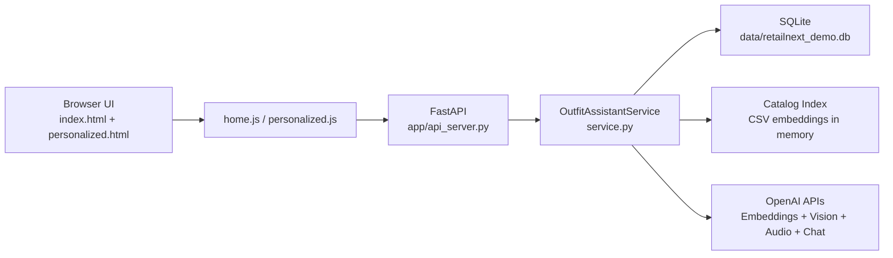

# Architecture

## System Overview

RetailNext Outfit Assistant is a single FastAPI service that serves both:

- Frontend pages (`/` and `/personalized`)
- API routes (`/api/*`)

The application uses:

- SQLite for sessions, recommendation storage, and match checks
- In-memory embedding index loaded from `sample_styles_with_embeddings.csv`
- OpenAI APIs for embeddings, image analysis, transcription, and optional match judgement
- Heuristic fallback logic for graceful degradation when AI requests fail

## Component Diagram

## Main Runtime Flows

### Natural Language Search

1. Frontend posts `/api/search` with query text.
2. Service embeds query and ranks nearest items using cosine similarity.
3. Session and recommendation rows are persisted in SQLite.
4. Frontend loads `/api/personalized/{session_id}`.

### Image Upload Match

1. Frontend uploads image to `/api/image-match`.
2. Service requests image analysis and generated search terms from OpenAI.
3. Service ranks results using one or more generated queries.
4. Session + recommendations are persisted and returned.

### Check Your Match

1. Frontend posts `/api/check-match` with `session_id` and `product_id`.
2. Service computes deterministic heuristic breakdown by signals.
3. If AI is available, LLM judgement is requested with timeout budget.
4. Returned rationale includes heuristic explanation and per-signal detail payload.
5. Match result is stored in DB and shown inline + in modal.

## Reliability Design

- Request timeouts are enforced with configurable `RN_AI_*_TIMEOUT_SECONDS` values.
- If OpenAI calls fail or timeout, service falls back to deterministic non-blocking behavior.
- Dev runner auto-selects a free port (default 8001) to avoid local port collisions.
- Frontend uses same-origin API calls to prevent split-port fetch failures.
